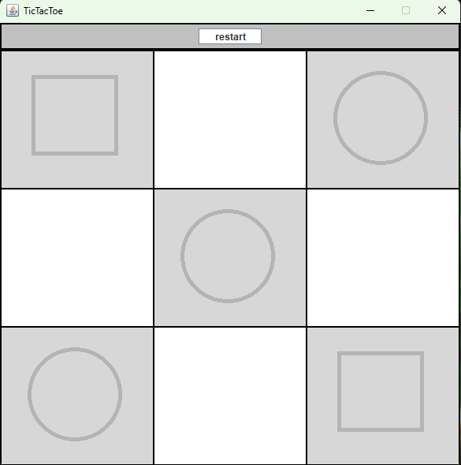

# TicTacToe_Game
## A Simple Tic-tac-Toe game for two players using Java Swing

The game works with a turn-based shifts, it ends when 3 figures are
line up in vertical, horizontal, or diagonal. The game ends in even
if there's no more spot available and none of the three previous scenarios
could be done

## How to play
* Use your mouse to click at an empty spot, once selected it can't
be undone

* Use the restart button to start a new game